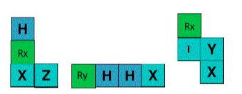
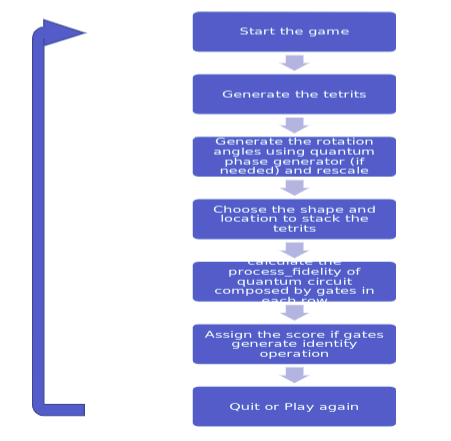
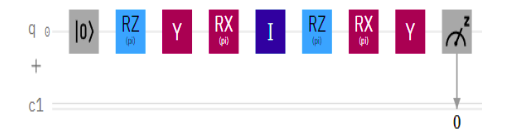
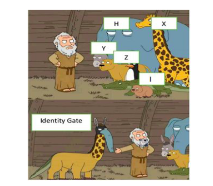

# **Q-TETRIS**

A as hard as (real) quantum computation way to play tetris.

## Team
Alessandro Credidio Furlan (Brazil), Lucas Moura de Almeida (Brazil), Prathamesh Sanjay Bhole (India) and Zhang Jie (China).

## Project Description

Qtetris is the game developed by our team as part of the iQuHACK 2022 (Microsoft + IonQ division). As the name tells us, Qtetris is inspired in the classical game Tetris, with a taste of quantum computation. In this game, random block sets are generated with a quantum random number generator. The blocks themselves are quantum gates (X, Y, Z, H etc.). Another big difference, which makes the game really hard, is the scoring system. A entire row is eliminated only when 7 or more blocks compose into an indentity operator. Also, in order to score, you must combine 3 or more blocks in a row that compose for an identity. Some examples of block sets are in the following image:

**Flowchart:**

**Game Rules:**

1. Run the code! to start playing the game
2. **Objective:** Usually, goal is to clear as many rows as possible while creating identity operation with as many gates as possible
3. Every completed row is executed on quantum computer: First qubit is prepared in |0\> then the different combination of gates in a same sequence (in that row) are applied to this single qubit and output is observed.
   1. If the combination of quantum gates which creates identity will be scored
   2. Score will be given as:
      Example- completed row have [Rz, Y, Rx, I, Rz, Rx, Y]
      
      
      This gives the ouput |0\> with 100% probability, so the score will be 7(number of quantum gates) \* 10 = 70
   3. Similarly in each completed row the maximum number of gates which gives 100% probability of occurrence of state |0\> with decide the score.
   4. In a completed line if multiple gate combinations create identity operation, then the maximum score is given based on number of gates used to create 100% probability of occurrence of state |0\>.
      For example – [I, I, I] and [I, Ry, Rx, X, X, Rz] do make |0\> with 100% probability, so the score will be 60 (maximum value between 30 and 60).
      
      
      
      **Note: Here 100% probability is observed through quantum simulator not actual quantum computer.**
